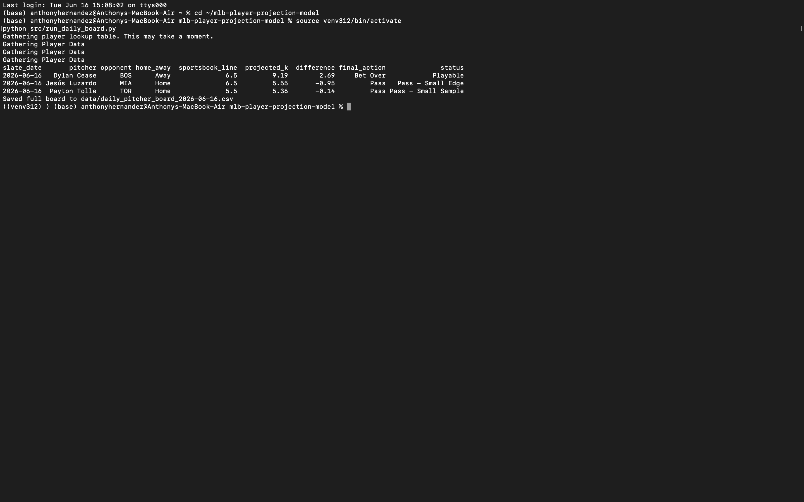

# MLB Player Projection Model

This project builds a basic MLB pitcher strikeout projection board.

## What It Does

The current notebook:

- pulls pitcher Statcast data with pybaseball
- converts pitch-level data into game-level strikeout logs
- calculates last 3, last 5, and season strikeout averages
- creates a projected strikeout number
- Pulls opponent team strikeout rate automatically from Statcast
- Creates an adjusted strikeout projection based on opponent strikeout tendency
- compares the projection to a manually entered sportsbook strikeout line
- labels each row as Over, Under, No Bet, or No Data
- adds basic game context like opponent and home/away
- saves a daily pitcher board to CSV

## Tools

- Python
- pandas
- numpy
- pybaseball
- Jupyter Notebook

## Example Output
The board includes both the pitcher-only projection(projected_k) and the opponent-adjusted projection(adjusted_projected_k).

| slate_date | pitcher | opponent | home_away | sportsbook_line | projected_k | opponent_k_per_game | adjusted_projected_k | difference | final_action | status |
|---|---|---|---|---:|---:|---:|---:|---:|---|---|
| 2026-06-16 | Dylan Cease | BOS | Away | 6.5 | 9.19 | 8.90 | 9.50 | 3.00 | Bet Over | Playable |
| 2026-06-16 | Jesús Luzardo | MIA | Home | 6.5 | 5.55 | 7.80 | 5.31 | -1.19 | Pass | Pass - Small Edge |



## How to Run the Daily Board

Launch Project from Terminal:

`cd ~/mlb-player-projection-model`

Update the slate settings file:

`nano data/slate_config.csv`

Example:

```csv
slate_date,season
2026-06-16,2026
```

Update the sportsbook lines file:

`nano data/daily_lines.csv`

Example:

```csv
pitcher,mlbam_id,opponent,home_away,line
Jesus Luzardo,666200,MIA,Home,6.5
Michael King,650633,STL,Away,4.5
Dylan Cease,656302,BOS,Away,6.5
```

Run the daily board from Terminal:

```bash
source venv312/bin/activate
python src/run_daily_board.py
```

The script saves the output to:

```text
data/daily_pitcher_board_YYYY-MM-DD.csv
```

## Run This Project Locally

Clone the repository:

```bash
git clone https://github.com/Anthony-Hernandez21/mlb-player-projection-model.git
cd mlb-player-projection-model
```

Create a virtual environment:

```bash
python3.12 -m venv venv312
source venv312/bin/activate
```

Install dependencies:

```bash
pip install pandas numpy pybaseball jupyter
```

Update the slate config:

```csv
slate_date,season
2026-06-16,2026
```

Update the daily lines file:

```csv
pitcher,opponent,home_away,line
Dylan Cease,BOS,Away,6.5
Jesús Luzardo,MIA,Home,6.5
```

Run the daily board:

```bash
python src/run_daily_board.py
```

The output CSV will be saved in the `data` folder.

## Project Structure

data/
  daily_lines.csv
  slate_config.csv
  daily_pitcher_board_YYYY-MM-DD.csv

notebooks/
  data_exploration.ipynb

src/
  projections.py
  run_daily_board.py

  ## Current Limitations

Sportsbook lines are entered manually.
The model is a simple baseline, not a validated betting system.
Opponent strikeout adjustment is simple and not yet backtested
No backtesting yet.

## Next Steps

Backtest past projections.
Add opponent strikeout tendencies.
Improve player lookup for accented names.
Add probable pitchers automatically.
